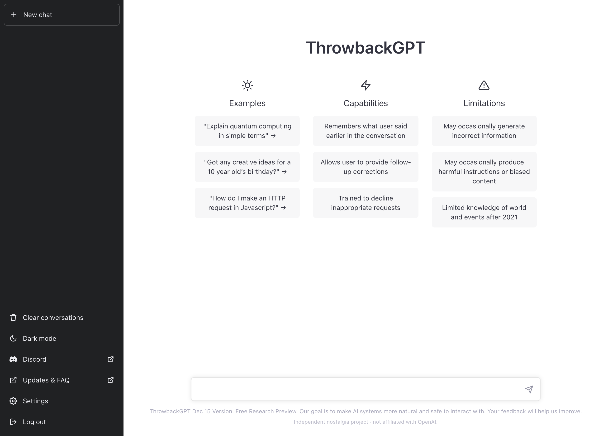
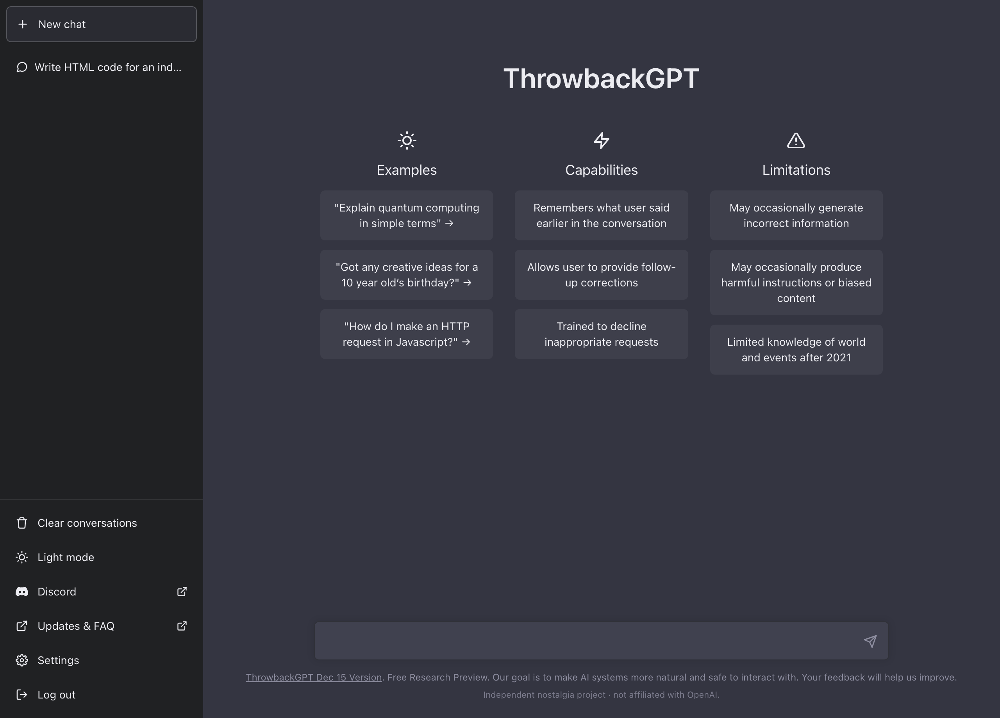
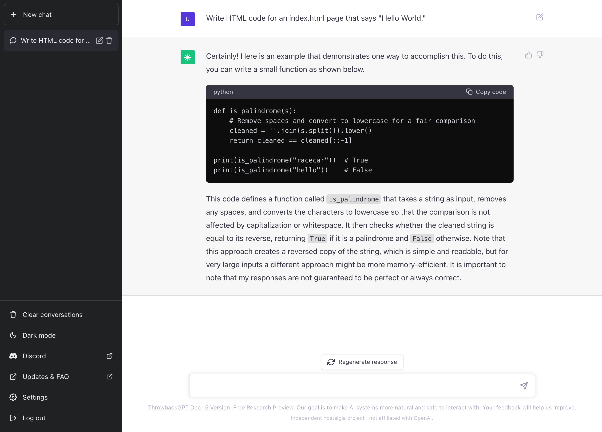

# ThrowbackGPT

A faithful, open-source recreation of the **original November–December 2022 ChatGPT** interface, powered by OpenAI's `gpt-4o-mini` wearing a researched **GPT-3.5 (2022) persona**.

### ▶ Live demo: **[throwbackgpt.arshawnarbabi.com](https://throwbackgpt.arshawnarbabi.com)**

[](https://throwbackgpt.arshawnarbabi.com)
[](LICENSE)


> **ThrowbackGPT is an independent nostalgia project and is not affiliated with, endorsed by, or sponsored by OpenAI.** The website, its UI, and its branding are original and unaffiliated. Chat responses are generated by OpenAI's `gpt-4o-mini` API (a paid OpenAI product) prompted to imitate the 2022 model — so the *model* is OpenAI's, but the *website* is not an OpenAI product and uses none of OpenAI's UI code, assets, or trademarks.



| | |
|---|---|
|  |  |

## About

This is a fun side project that I thought was interesting and wanted to build. It began as a nostalgia experiment, an attempt to recreate the original launch-day ChatGPT as closely as possible, both the way it looked and the way the old model used to talk. It ended up becoming a faithful, eval-tuned clone of the late-2022 experience. The hosted demo above is the easiest way to try it; you only need to clone or fork the repo if you want to run or modify your own copy.

## What it is

- A pixel-faithful recreation of the **Classic Dec-2022 ChatGPT UI**, built from scratch: the dark sidebar, the ☀️ Examples / ⚡ Capabilities / ⚠️ Limitations welcome screen, alternating message rows, dark "Copy code" blocks, the "Free Research Preview" footer.
- Powered by **`gpt-4o-mini`**, system-prompted to behave like **GPT-3.5 as it actually was in late 2022** — the 2021 knowledge cutoff ("I'm sorry, but… my knowledge has a cutoff of 2021"), the verbose hedging, prose-first answers, the prose → code → caveat shape, and the era's confident hallucination. The persona was reverse-engineered from primary sources and tuned against a 12-prompt eval (see [`docs/`](docs/)).
- Falls back to a **mock mode** (canned, era-flavored replies) when no API key is set, so the full UI is usable offline.

## Features

- Token-by-token streaming with the blinking cursor; **Stop generating** / **Regenerate response**
- **Light + dark** themes (default light, like the original — the sidebar stays dark in both, also like the original)
- Multi-chat history in the sidebar with inline rename/delete, persisted to `localStorage`
- Boots **straight into the chat**; first-run **onboarding** modal, settings, and a thumbs-down feedback modal
- The iconic **"ChatGPT is at capacity"** easter egg (`/capacity`)
- Markdown answers with dark code blocks + inline code, responsive mobile drawer
- Automatic **OpenAI prompt caching** (the ~3.3k-token system prompt is cached for ~50% off on repeat calls)

## Tech stack

Next.js (App Router) · TypeScript · Tailwind CSS · Zustand · OpenAI `gpt-4o-mini` (streaming)

## Getting started

You don't need to run anything to try it — use the [live demo](https://throwbackgpt.arshawnarbabi.com). To run your own copy:

```bash
git clone https://github.com/arshawnarbabi/ThrowbackGPT.git
cd ThrowbackGPT
npm install
cp .env.example .env.local   # add your OpenAI key (optional — mock mode works without it)
npm run dev
```

Open <http://localhost:3000>.

### Environment variables

| Variable | Required | Default | Notes |
|---|---|---|---|
| `OPENAI_API_KEY` | for the live model | — | Server-side only. Without it, the app runs in mock mode. **Never** prefix with `NEXT_PUBLIC_`. |
| `OPENAI_MODEL` | no | `gpt-4o-mini` | Override the chat model if you like. |

## Deploy (Vercel)

1. Import this repo into Vercel.
2. **Project → Settings → Environment Variables** → add `OPENAI_API_KEY` (Production, and Preview if desired). Keep it server-side — no `NEXT_PUBLIC_` prefix.
3. Deploy. (It builds and runs without the key too — just in mock mode.)

## How the persona works

The "make `gpt-4o-mini` act like 2022 GPT-3.5" recipe lives in:

- **[`docs/system-prompt.md`](docs/system-prompt.md)** — the final system prompt + sampling parameters.
- **[`docs/gpt35-behavioral-profile.md`](docs/gpt35-behavioral-profile.md)** — the evidence-based behavioral profile (tone, the 2021 cutoff, signature phrasings, refusal style, formatting) drawn from OpenAI's Nov-2022 sources, the InstructGPT paper, and contemporaneous transcripts.
- **[`verification/EVAL.md`](verification/EVAL.md)** — the before/after eval that tuned the prompt.

## Project structure

```
app/            Next.js App Router (pages, layout, /api/chat streaming route)
components/     UI components (sidebar, chat, composer, modals, …)
lib/            store (Zustand + localStorage), system prompt, icons, logo
docs/           system prompt, GPT-3.5 behavioral profile, preview images
verification/   capture + eval scripts and reports
PLAN.md         the original build plan
CHANGELOG.md    release notes
```

## Disclaimer & notes

- **Not affiliated with OpenAI.** The website, UI, and branding are independent and unaffiliated. The model backend is OpenAI's `gpt-4o-mini` API, but ThrowbackGPT itself is not an OpenAI product. "ChatGPT", "GPT", and the OpenAI logo are trademarks of OpenAI and are not used here — the in-app wordmark is "ThrowbackGPT" and the logo mark is an original design.
- The model **intentionally reproduces documented 2022-era flaws** (confident hallucination, easy roleplay jailbreaks) as a faithful recreation, inside an app that prominently warns it "may produce inaccurate information." Do not rely on its output.
- Reference screenshots used during development are **not** included in this repo (third-party images).

## License

[MIT](LICENSE) © 2026 Arshawn Arbabi
